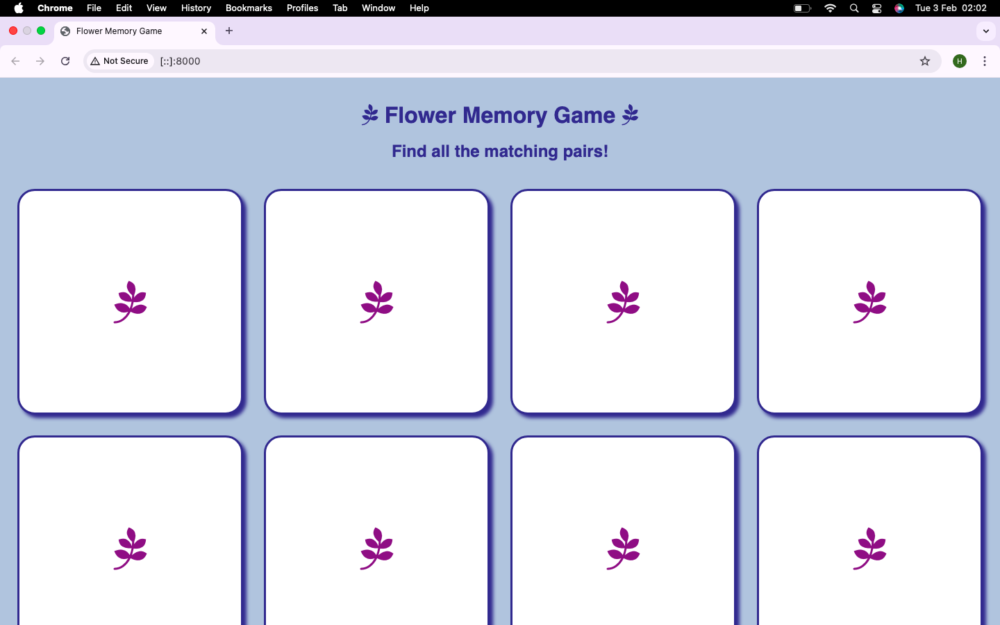
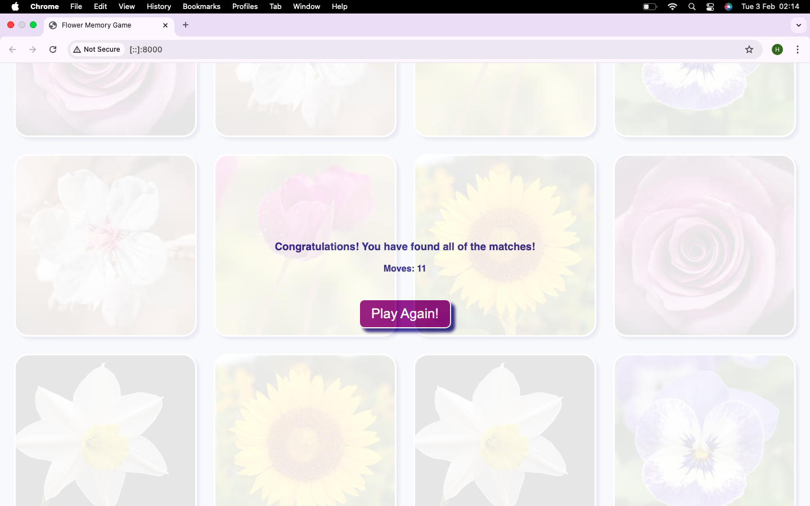
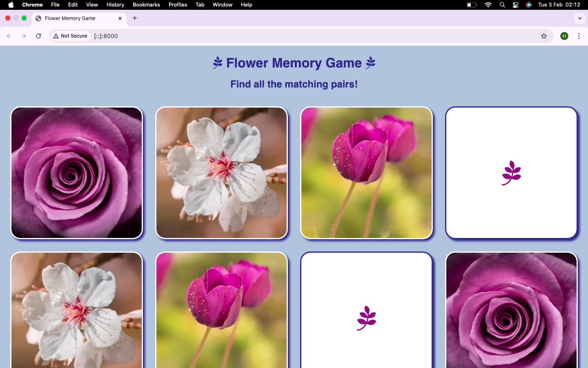
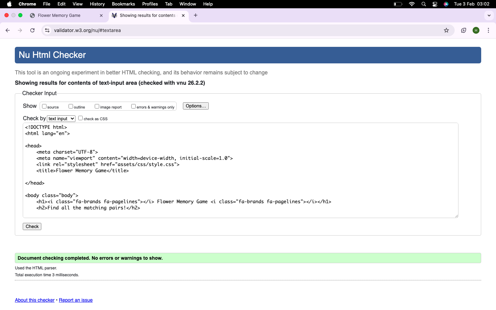
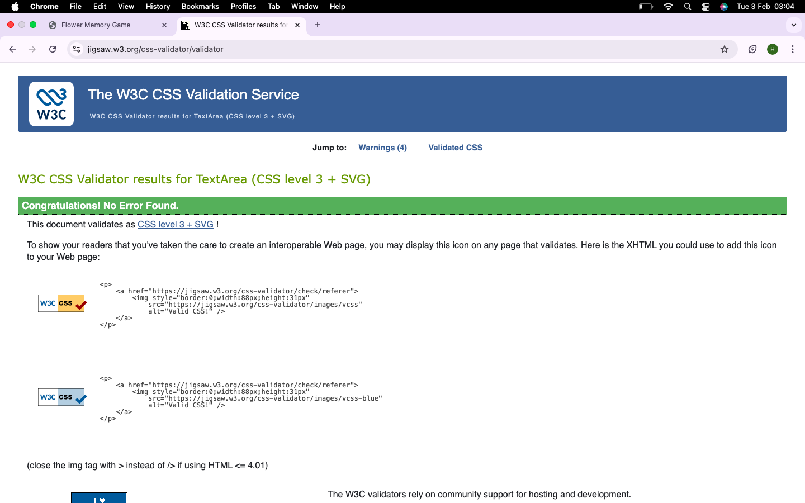
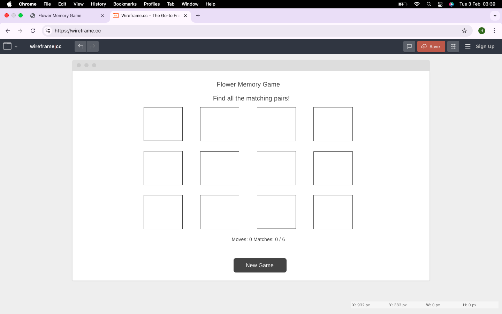
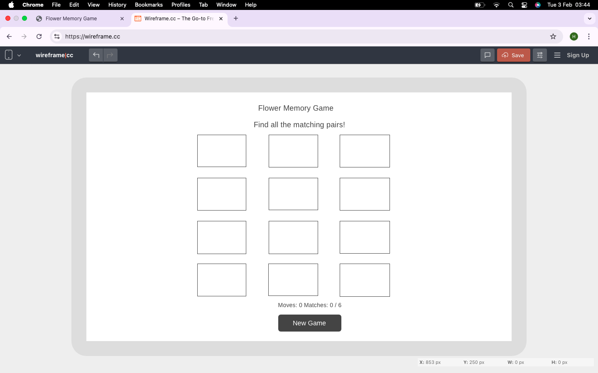
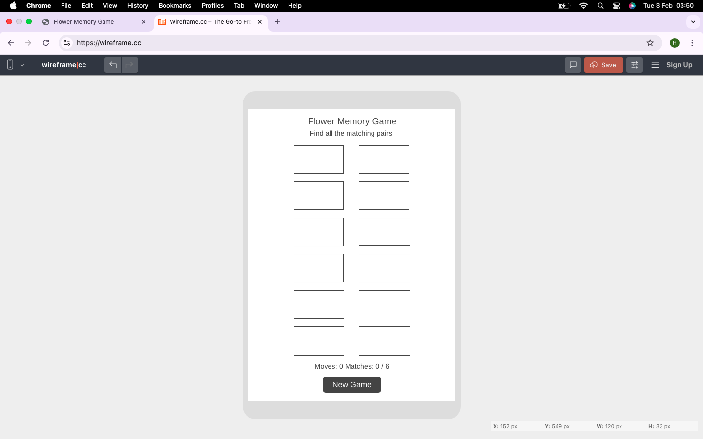

# Flower Memory Game

This is a flower themed memory game. The player needs to find all of the matching pairs to complete the game. This game is aimed at individuals aged 6 and above. 

The main goal of this game is to be engaging and user friendly. It should also be responsive to the user.

## User Stories

- As someone who works on the computer for several hours a day, I would like to play a calming game when taking a break.

*The main colour chosen for the game is a shade of blue. This colour is neither too bright nor too dark. It is not overpowering and provides a soothing interface for the game.*

- As a parent, I would like a short, straightforward, game that I can play with my child again and again.

*The game consists of six pairs of cards. This ensures that the game doesn't finish too slowly or too quickly. Each game typically lasts a few minutes, which makes it ideal for parents and children alike.  The "Play Again" button allows the game to be easily replayed as necessary.*

- As an elderly individual, I would like to play a simple game that is suitable for people my age.

*Using eye-catching, clear images and large text ensures that this game is also suitable for the elderly. This type of game has existed for many years, and will be intuitive to the older generation.*

## Testing

### Manual Testing

**Procedure:**

- Read the written content carefully to ensure there are no spelling/grammatical errors.
- Click on each card and check that the cards are turning, and the images are loading correctly.
- Click the "New Game" button to check that it works as required.
- Play the game to determine if it is working as it should. Check that the "Moves" and "Matches" are incrementing properly.
- Ensure that the "win" div displays when all the pairs have been found. Check the functionality of the "Play Again" button.

**Results:**

- When hovering over the cards, the gap between the cards was not sufficient enough. 

*Increased the gap from 10px to 30px in CSS to fix this.*

- When hovering over the cards, the cards were overlapping the "results" div.

*Added margin-bottom of 40px to the "game-area" div in CSS to prevent the overlapping.*

- The "win" div was not visible enough at the end of the game.

*Adjusted the opacity from 0.5 to 0.9 to correct this.*

- The "results" div was not displaying in the center on screens smaller than 480px.

*Added max-width property to the relevant media queries to center the div.*

### Automated Testing

HTML Checker

CSS Checker

## Attributions
- <a href="https://www.w3schools.com/">W3 Schools</a> - This website was extremely helpful with my understanding of many CSS and Javascript terms.

- <a href="https://www.google.com/search?q=code+along+memory+game+javascript&rlz=1C5MACD_enGB1104GB1105&oq=code+along+memory&gs_lcrp=EgZjaHJvbWUqCAgBEEUYJxg7MgYIABBFGDkyCAgBEEUYJxg7MgcIAhAAGO8FMgoIAxAAGKIEGIkFMgoIBBAAGIAEGKIEMgcIBRAAGO8FMgYIBhBFGDsyBggHEEUYPNIBCTEwMzM3ajBqN6gCALACAA&sourceid=chrome&ie=UTF-8#fpstate=ive&vld=cid:0a1bae46,vid:rcWBLFXH7uA,st:0">Codynn - YouTube</a> - I followed along with this video to write the code for this game. Without this video, I would not have been able to write the main code for shuffling cards and creating the div for the "game-area". It was instrumental in helping me to write the code for this project.

- <a href="https://stackoverflow.com/">Stack Overflow</a> - I used this website when encountering problems or when I was unable to understand parts of the code from the above video.

#### Photo Attributions

- <a href="https://www.freepik.com/free-photo/purple-tulip-flowers-field_13563030.htm">Image by wirestock on Freepik</a>
- <a href="https://www.freepik.com/free-photo/closeup-shot-beautiful-pink-rose-head_22859669.htm">Image by wirestock on Freepik</a>
- <a href="https://www.freepik.com/free-photo/lovely-white-daffodil-flower_136123968.htm">Image by frimufilms on Freepik</a>
- <a href="https://www.freepik.com/free-photo/sunflower-natural-background-sunflower-blooming-spring_13181356.htm">Image by tawatchai07 on Freepik</a>
- <a href="https://www.freepik.com/free-photo/beautiful-shot-white-purple-flowers-park-sunny-day_10303018.htm">Image by wirestock on Freepik</a>
- <a href="https://www.freepik.com/free-photo/almond-blossom_4288596.htm">Image by efe_madrid on Freepik</a>

## Wireframes

## Project Deployment   

To create and deploy a project, please use the following steps:

**Steps to create a project:**

1. Open GitHub and click on the green button to create a new repository.
2. Choose a repository name, and make sure to select "public".
3. Next, press the "Create a repository" button.
4. Copy the code to create a new repository on the command line.
5. Create a new folder with the same name as the new repository.
6. Use VSCode to open the new folder.
7. Open the terminal, paste the copied code (from GitHub) and press enter.
8. Create HTML and CSS files.
9. Write, commit and push your code.
       

**Steps to deploy a project:**

1. On GitHub, open the repository that you would like to deploy to Github Pages.
2. Select "Settings", and then "Pages".
3. For "Source", select "Deploy from a branch". 
4. For "Branch", select "Main". Then click "Save".
5. You have now deployed your project (This can take a few minutes).

Link to deployed project:
<a href="https://hragunathan-03.github.io/flower-memory/">Flower Memory Game</a>